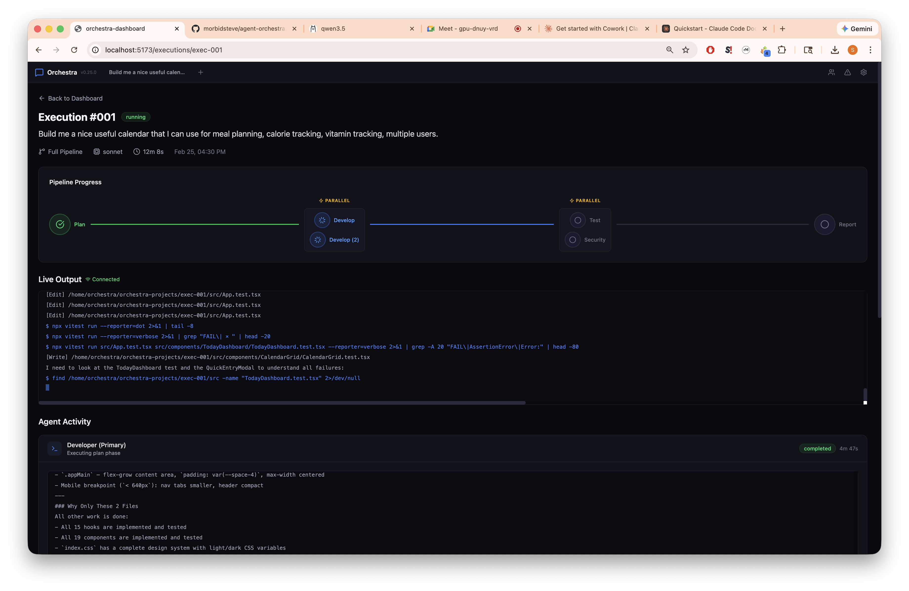

# Agent Orchestra

[](https://python.org)
[](https://react.dev)
[](LICENSE)

A multi-agent development system where you describe what you want to build in plain language, and eight specialized AI agents plan, develop, test, secure, and ship it — orchestrated in real time through a conversational interface.

## Quick Start

```bash
git clone https://github.com/morbidsteve/agent-orchestra.git
cd agent-orchestra
make
```

That's it. `make` creates a Python venv, installs Node dependencies, and starts both servers. Open **http://localhost:5173** — a setup wizard walks you through connecting Claude Code and GitHub.

Don't have Python/Node/Make? The setup script handles everything:

```bash
curl -fsSL https://raw.githubusercontent.com/morbidsteve/agent-orchestra/master/setup.sh | bash
```

<details>
<summary>Docker</summary>

```bash
docker build -t agent-orchestra .
docker run --rm -p 5173:5173 -p 8000:8000 agent-orchestra
```

</details>

<details>
<summary>Devcontainer (Trail of Bits)</summary>

```bash
devc .          # build and start the container
devc shell      # open a shell inside it
make            # install deps + start servers
```

</details>

---



---

## Features

### Conversational Console

The primary interface at `/` is a chat-style console. Describe what you want — "add OAuth login to the backend," "run a security audit on the payments module," "evaluate whether we should add real-time collaboration" — and the orchestrator detects your intent, selects the right workflow, and executes it.

The split-panel layout puts the conversation on the left and a live context panel on the right, showing execution progress, agent activity, and screenshot captures as work happens.

### Agent Office

A visual node graph at `/office` shows all eight agents arranged around a central Orchestrator hub. Each node reflects real-time status: idle pulse, working spin with glow, or completed checkmark. Animated SVG connection lines visualize data handoffs between agents as a pipeline runs.

### Screenshot System

Terminal snapshots are captured automatically after each pipeline phase, and browser screenshots are taken via Playwright during the security phase. View them in a timeline, a lightbox, or as a carousel in the console context panel.

### Business Dev Evaluation

Type something like "evaluate whether we should add real-time collaboration" and the system spawns a Business Dev agent. A progressive card fills in live: Market Research, Competitive Analysis, ICE Score, and a final recommendation of **BUILD**, **DEFER**, or **INVESTIGATE**.

---

## Architecture

```
┌─────────────────────────────────────────────────────────────┐
│                   Console (React 19)                        │
│  Chat Interface  |  Agent Office  |  Screenshot Timeline    │
│                       :5173                                 │
└───────────┬───────────────────────┬─────────────────────────┘
            │ REST                  │ WebSocket
┌───────────▼───────────────────────▼─────────────────────────┐
│                  Backend (FastAPI)                           │
│  Conversations ─ Executions ─ Screenshots ─ Auth ─ WS       │
│                       :8000                                 │
└───────────┬─────────────────────────────────────────────────┘
            │ subprocess
┌───────────▼─────────────────────────────────────────────────┐
│              Orchestrator (Claude Agent SDK)                 │
│  Developer ─ Developer 2 ─ Tester ─ DevSecOps ─ BizDev      │
│  Frontend Dev ─ Backend Dev ─ DevOps                         │
└─────────────────────────────────────────────────────────────┘
```

The Console sends messages over REST; the backend creates or resumes a conversation, spawns the orchestrator as a subprocess, and streams agent output back to the browser over a WebSocket.

## Agents

| Agent | Role | Specialty |
|-------|------|-----------|
| Developer (Primary) | `developer` | Architecture, complex implementations, code review |
| Developer (Secondary) | `developer-2` | Independent modules, parallel features |
| Tester | `tester` | Unit/integration tests, coverage analysis |
| DevSecOps | `devsecops` | Vulnerability scanning, secret detection, dependency audit |
| Business Dev | `business-dev` | Market analysis, competitive research, ICE scoring |
| Frontend Dev | `frontend-dev` | React components, styling, UI/UX |
| Backend Dev | `backend-dev` | API endpoints, services, data models |
| DevOps | `devops` | Docker, CI/CD, deployment, infrastructure |

## Routes

| Path | Page | Purpose |
|------|------|---------|
| `/setup` | Setup Wizard | First-run auth flow (Claude + GitHub) |
| `/` | Console | Primary conversational interface |
| `/dashboard` | Dashboard | Execution overview and agent status |
| `/office` | Agent Office | Live agent node-graph visualization |
| `/executions/:id` | Execution Detail | Deep dive into a single run |
| `/agents` | Agents | Agent management and status |
| `/findings` | Findings | Security and quality findings |
| `/settings` | Settings | GitHub and Claude Code authentication |

All routes except `/setup` require both Claude and GitHub authentication.

## API

| Method | Path | Description |
|--------|------|-------------|
| `POST` | `/api/conversations` | Start a new conversation |
| `GET` | `/api/conversations` | List conversations |
| `GET` | `/api/conversations/:id` | Get conversation details |
| `POST` | `/api/conversations/:id/messages` | Send a message |
| `WS` | `/api/ws/console/:id` | Real-time console streaming |
| `POST` | `/api/executions` | Create and start an execution |
| `GET` | `/api/executions` | List all executions |
| `GET` | `/api/executions/:id` | Get execution details |
| `WS` | `/api/ws/:execution_id` | Real-time execution streaming |
| `GET` | `/api/screenshots` | List screenshots |
| `POST` | `/api/screenshots` | Upload a screenshot |
| `GET` | `/api/screenshots/:id` | Get screenshot metadata |
| `GET` | `/api/screenshots/:id/image` | Get screenshot image |
| `GET` | `/api/agents` | List agents with status |
| `POST` | `/api/agents` | Register an agent |
| `DELETE` | `/api/agents/:role` | Remove an agent |
| `GET` | `/api/findings` | List findings (filterable) |
| `GET` | `/api/auth/status` | Auth status (GitHub + Claude) |
| `POST` | `/api/auth/github/login` | Start GitHub device flow |
| `POST` | `/api/auth/claude/login` | Start Claude OAuth flow |
| `GET` | `/api/filesystem/browse` | Browse project files |
| `GET` | `/api/health` | Health check |

## Tech Stack

| Layer | Stack |
|-------|-------|
| Frontend | React 19, TypeScript 5.9, Tailwind CSS 4, Vite 7 |
| Backend | Python 3.11+, FastAPI, Pydantic 2, Uvicorn |
| Testing | Vitest + React Testing Library |
| Orchestrator | Claude Agent SDK, Claude Code CLI |

## Make Targets

```bash
make              # install deps + start dev servers (default)
make setup        # install Python + Node dependencies only
make dev          # start backend + frontend
make test         # run frontend test suite
make lint         # ESLint + TypeScript type check
make build        # production build
make check        # test + lint + build (all quality gates)
make clean        # remove .venv, node_modules, dist
make stop         # kill the background backend process
```

## Workflows

The orchestrator supports five workflows. The Console selects the right one automatically based on your message.

| Workflow | Phases | When to use |
|----------|--------|-------------|
| Full Pipeline | Plan → Develop → Test → Security → Report | New features, refactors |
| Code Review | Plan → Develop + Test + Security (parallel) → Report | PR reviews |
| Security Audit | Plan → Security → Report | Vulnerability scanning |
| Feature Eval | Plan → BizDev + Developer → Report | Feasibility and market analysis |
| Quick Fix | Develop → Test → Report | Small bug fixes |

## License

MIT
